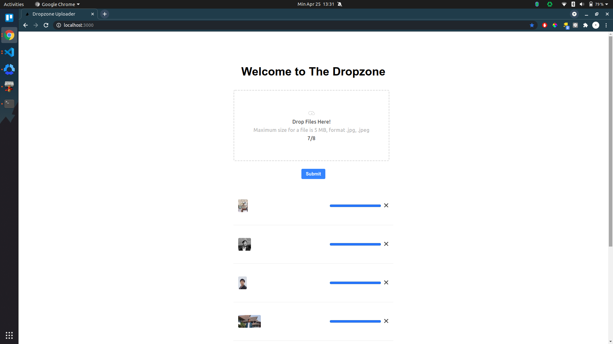

# Dropzone Uploader

This is a simple implementation of the `react-dropzone-uploader` (source [here](https://react-dropzone-uploader.js.org/)) built on top of React using [next.js](https://nextjs.org/), [typescript](https://www.typescriptlang.org/), [chakra-ui](https://chakra-ui.com/).

## Getting Started
- install [VSCode](https://code.visualstudio.com/)
- `git clone https://github.com/royyandzakiy/react-dropzone-uploader`
- `cd react-dropzone-uploader`
- `yarn install`
- `yarn dev`

